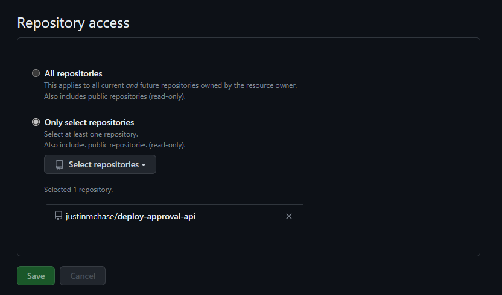
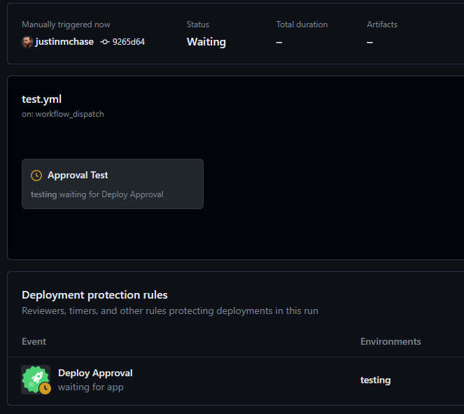
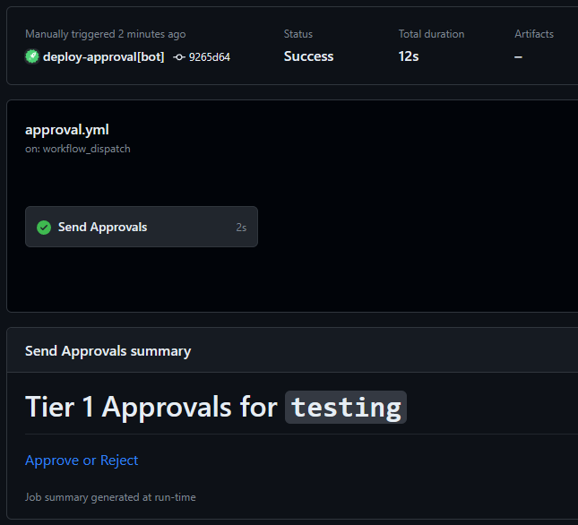
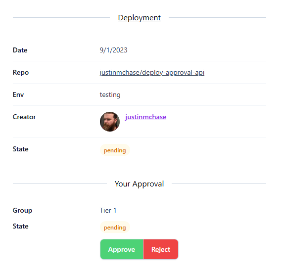
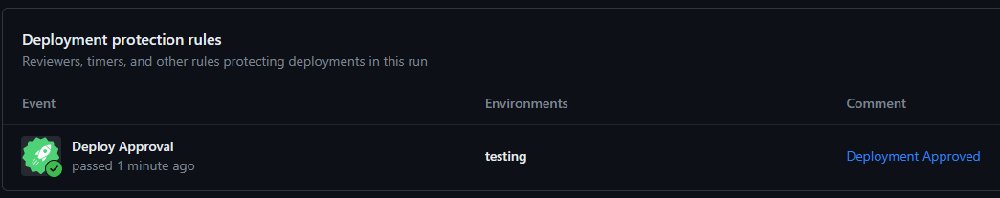

# Deploy Approval Installation

This document will outline the steps needed to get Deploy Approval installed and
working correctly.

# Install

Head over to the
[Deploy Approval Application](https://github.com/apps/deploy-approval) page and
press the "Configure" button.


From the configuration screen select orgs and one or more repositories to
install the deploy approval into.



# Configure Environments

From the settings of a repository that has the app installed upon it simply go
into the repository settings and create or edit an Environment, create one
called `testing` for this example.

From within the `testing` environment you should now see a new entry in the
"Deployment proection rules" section called "Deploy Approval" with a green icon.
Simply check the box next to it and click "Save".


# Approval Group Configuration

Add a file to your repository at `.github/approval.yml` and add the following
contents:

```yml
groups:
  - id: tier1
    name: Tier 1

  - id: tier2
    name: Tier 2

environments:
  testing:
    groups:
      - tier1
      - tier2
```

The environment name under the environments section should match the environment
name you added in the previous step, `testing` for this example. You can define
as many groups as you want and assign them to any environments.

# Approval Workflow

Create a file at `.github/workflows/approval.yml` with the following content:

```yml
name: Deployment Approval
on:
  workflow_dispatch:
    inputs:
      environment:
        type: string
        required: true
      group-id:
        type: string
        required: true
      group-name:
        type: string
        required: true
      approval-url:
        type: string
        required: true

jobs:
  test:
    name: Send Approvals
    runs-on: [ubuntu-latest]
    steps:
    - run: |
        echo "# $GROUP_NAME Approvals for \`$ENVIRONMENT\`" >> $GITHUB_STEP_SUMMARY
        echo "[Approve or Reject]($APPROVAL_URL)" >> $GITHUB_STEP_SUMMARY
      env:
        ENVIRONMENT: ${{ inputs.environment }}
        GROUP_ID: ${{ inputs.group-id }}
        GROUP_NAME: ${{ inputs.group-name }}
        APPROVAL_URL: ${{ inputs.approval-url }}
```

When an approval is needed, this workflow will be dispatched for each approval
group. In this example the approval url is simply printed in the workflow run
summary for anyone to approve but in your own workflow you might send an email
to an approvers group or a notifaction to a teams channel, etc.

# Create a Deployment

Create a file at `.github/workflows/test.yml` with the following content:

```yml
name: Test The Approval Workflow
on:
  workflow_dispatch:
jobs:
  test:
    name: Approval Test
    runs-on: [ubuntu-latest]
    environment: testing
    steps:
    - run: echo "Success!" >> $GITHUB_STEP_SUMMARY
```

Note the presence of `environment: testing`. When you dispatch this workflow a
Deployment will be created and since we have configured the Deployment Approval
app as a Deployment protection rule. This deployment will be blocked, pending
approval from the Deployment Approval app.



Additionally, two dispatches of the `approval.yml` worklfow will be launched,
one for each approval group configured for the environment.



From there users can go to the `approval-url` provided as an input parameter to
Approve or Reject the deployment.



Once all approval groups have been approved, then the workflow becomes approved.



Similarly if any deployment group has a rejection then the entire deployment
will be rejected. If any deployment group is pending then the approvals of other
groups can still be updated. Once an approval or rejection is recorded for each
group, then the GitHub Deployment will be marked as Approved or Rejected and no
further editing or approvals or rejections can be made. If a deployment is
rejected then a new deployment must be kicked off to launch new approvals.
